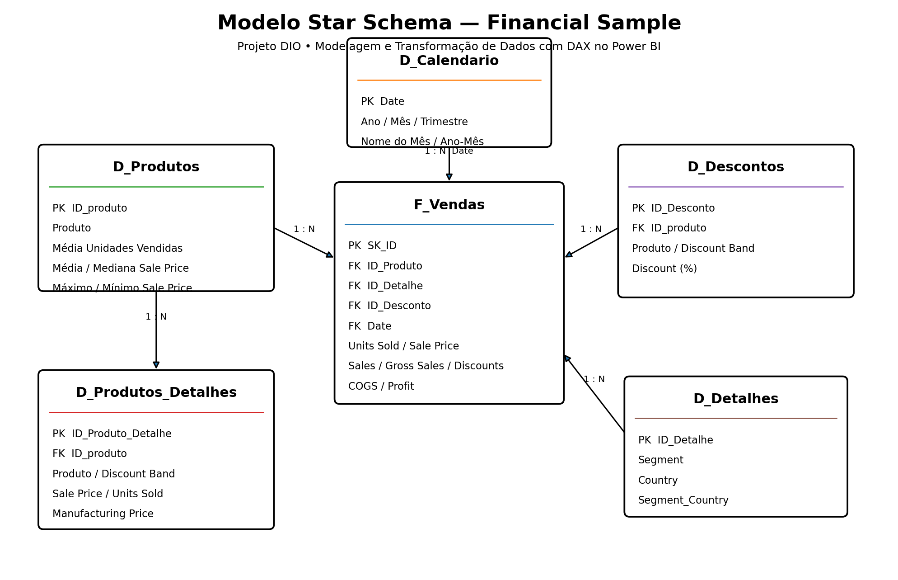

# Modelagem e Transformação de Dados com DAX no Power BI

## Desafio de Projeto — DIO

Este repositório apresenta a solução do desafio **Modelagem e Transformação de Dados com DAX no Power BI**, utilizando a base **Financial Sample**. O projeto transforma a estrutura originalmente tabular em um modelo dimensional orientado a análises, com tabela fato, dimensões, dimensão calendário e medidas DAX.

O foco da entrega é demonstrar, de forma organizada e reproduzível, o processo de preparação dos dados no Power Query, a construção do modelo dimensional e a utilização de DAX no Power BI.

## Base utilizada

A base `Financial Sample.xlsx` contém **700 registros e 16 campos**, abrangendo vendas de 2013 e 2014. Na base utilizada neste projeto foram identificados:

- 6 produtos;
- 5 segmentos;
- 5 países;
- 4 faixas de desconto;
- período de vendas de 01/01/2013 a 01/12/2014.

O arquivo original utilizado no projeto está disponível em `dados/Financial Sample.xlsx`.

## Modelo dimensional

O modelo foi estruturado a partir da consulta de origem `Financials_origem` e das seguintes tabelas:

| Tabela | Tipo | Finalidade |
|---|---|---|
| `F_Vendas` | Fato | Armazena as transações e métricas de vendas. |
| `D_Produtos` | Dimensão | Consolida os produtos e indicadores estatísticos solicitados no desafio. |
| `D_Produtos_Detalhes` | Dimensão auxiliar | Mantém atributos detalhados dos produtos e das condições de venda. |
| `D_Descontos` | Dimensão | Organiza produto, faixa de desconto e percentual de desconto. |
| `D_Detalhes` | Dimensão | Organiza as combinações de segmento e país. |
| `D_Calendario` | Dimensão | Permite análises por data, ano, mês, trimestre e dia da semana. |



## Relacionamentos propostos

| Dimensão | Chave | Fato / dimensão relacionada | Cardinalidade |
|---|---|---|---|
| `D_Calendario` | `Date` | `F_Vendas[Date]` | 1:N |
| `D_Produtos` | `ID_produto` | `F_Vendas[ID_Produto]` | 1:N |
| `D_Descontos` | `ID_Desconto` | `F_Vendas[ID_Desconto]` | 1:N |
| `D_Detalhes` | `ID_Detalhe` | `F_Vendas[ID_Detalhe]` | 1:N |
| `D_Produtos` | `ID_produto` | `D_Produtos_Detalhes[ID_produto]` | 1:N |

Foram adicionadas chaves substitutas em dimensões cujo conjunto de atributos poderia gerar duplicidades. Essa decisão reduz o risco de relacionamentos muitos-para-muitos e torna o modelo mais consistente para navegação analítica.

## Estrutura das tabelas

### D_Produtos

Contém `ID_produto`, `Produto`, média de unidades vendidas, média e mediana do preço de venda e valores máximo e mínimo do preço de venda. O identificador de produto inicia em 0, conforme o exercício.

### D_Produtos_Detalhes

Contém `ID_Produto_Detalhe`, `ID_produto`, `Produto`, `Discount Band`, `Sale Price`, `Units Sold` e `Manufacturing Price`.

### D_Descontos

Contém `ID_Desconto`, `ID_produto`, `Produto`, `Discount Band` e `Discount`. O percentual é calculado a partir da razão entre o valor de descontos e as vendas brutas.

### D_Detalhes

Contém `ID_Detalhe`, `Segment`, `Country` e uma chave textual auxiliar `Segment_Country`.

### F_Vendas

Contém `SK_ID`, chaves das dimensões, produto, quantidade vendida, preço de fabricação, preço de venda, faixa de desconto, segmento, país, vendas brutas, descontos, vendas líquidas, COGS, lucro e data.

### D_Calendario

A dimensão calendário cobre o intervalo completo de **01/01/2013 a 31/12/2014** e contém ano, número e nome do mês, trimestre, dia e nome do dia da semana e ano-mês.

## DAX — dimensão calendário

```DAX
D_Calendario =
ADDCOLUMNS(
    CALENDAR(DATE(2013, 1, 1), DATE(2014, 12, 31)),
    "Ano", YEAR([Date]),
    "Mês", MONTH([Date]),
    "Nome do Mês", FORMAT([Date], "MMMM"),
    "Trimestre", "T" & FORMAT(QUARTER([Date]), "0"),
    "Dia da Semana", WEEKDAY([Date], 2),
    "Nome do Dia", FORMAT([Date], "dddd"),
    "Ano-Mês", FORMAT([Date], "YYYY-MM")
)
```

O código completo está em `scripts/dax/D_Calendario.dax`.

## Medidas DAX incluídas

O projeto também documenta medidas de apoio à análise: Total Vendas, Total Lucro, Quantidade Vendida, Total Descontos, Custo Total, Margem de Lucro %, Vendas Ano Anterior e Crescimento YoY %.

As fórmulas estão em `scripts/dax/Medidas_DAX.dax`.

## Power Query

As consultas M foram documentadas individualmente na pasta `scripts/power-query/`. Elas cobrem a carga da base, padronização de tipos, agrupamentos, remoção de duplicidades, criação de índices e chaves, cálculo da taxa de desconto e construção da tabela fato.

## Estrutura do repositório

```text
ENTREGA_FINAL_DIO_PowerBI_Viviane_Rambor/
├── README.md
├── ENTREGA_DIO.md
├── CHECKSUMS.txt
├── .gitignore
├── .gitattributes
├── dados/
│   └── Financial Sample.xlsx
├── powerbi/
│   └── Modelagem_DAX_PowerBI_Viviane_Rambor.pbix
├── modelo-referencia/
│   └── Modelo_Dimensional_Referencia.xlsx
├── imagens/
│   └── modelo-star-schema.png
├── scripts/
│   ├── dax/
│   │   ├── D_Calendario.dax
│   │   └── Medidas_DAX.dax
│   └── power-query/
│       ├── Financials_origem.pq
│       ├── D_Produtos.pq
│       ├── D_Produtos_Detalhes.pq
│       ├── D_Descontos.pq
│       ├── D_Detalhes.pq
│       └── F_Vendas.pq
└── docs/
    ├── PROCESSO_CONSTRUCAO.md
    ├── VALIDACAO.md
    └── GUIA_ENTREGA_GITHUB_DIO.md
```

## Como abrir o projeto

Abra `powerbi/Modelagem_DAX_PowerBI_Viviane_Rambor.pbix` no Power BI Desktop. Os dados estão incorporados ao arquivo. Caso seja necessário atualizar a consulta e o Power BI solicite a localização da fonte, aponte a origem para `dados/Financial Sample.xlsx`.

A planilha `modelo-referencia/Modelo_Dimensional_Referencia.xlsx` contém as tabelas derivadas da mesma base e pode ser utilizada para conferir os resultados das transformações.

## Validação

A entrega inclui uma validação estrutural do arquivo PBIX, conferência da base e verificação da planilha dimensional. Os detalhes estão em `docs/VALIDACAO.md`.

## Tecnologias

- Microsoft Power BI Desktop
- Power Query / Linguagem M
- DAX
- Modelagem Dimensional
- Star Schema
- Excel
- Git e GitHub

## Autora

**Viviane Rambor**

Projeto desenvolvido para fins educacionais como parte da formação em Power BI da **DIO**.
